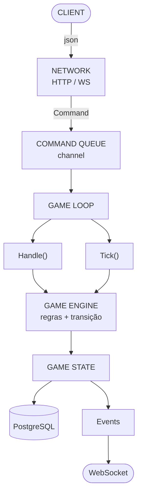
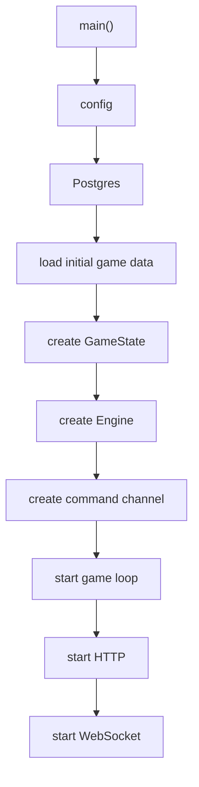
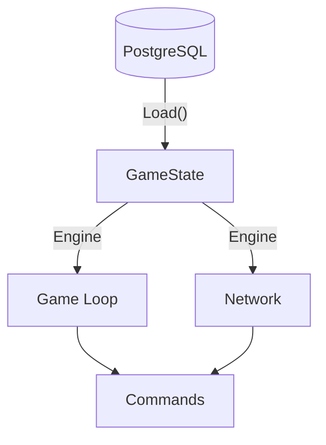

# Go Server


## Arquitetura


## Fluxo de inicialização



*Visualmente*:


## Estrutura pensada inicialmente para o jogo
```
escoria/
│
├── cmd/
│   └── server/
│       └── main.go
│
├── internal/
│   │
│   ├── account/
│   │   ├── account.go
│   │   ├── repository.go
│   │   └── service.go
│   │
│   ├── character/
│   │   ├── character.go
│   │   ├── repository.go
│   │   └── service.go
│   │
│   ├── world/
│   │   ├── world.go
│   │   └── service.go
│   │
│   ├── combat/
│   │   └── service.go
│   │
│   ├── gamedata/
│   │   └── ...
│   │
│   ├── persistence/
│   │   └── postgres/ 
│   │       ├── account_repository.go
│   │       └── character_repository.go
│   │
│   └── network/
│       │
│       ├── http/
│       │   ├── server.go
│       │   ├── account_handler.go
│       │   └── character_handler.go
│       │
│       └── ws/
│           ├── server.go
│           ├── connection.go
│           └── handler.go
│
└── data/
```

E a dependência ficaria assim:
```
                  ┌───────────────┐
                  │     main      │
                  └───────┬───────┘
                          │
                 composição da aplicação
                          │
         ┌────────────────┼────────────────┐
         │                │                │
         ▼                ▼                ▼
      Gamedata        Services         Network
                           │          ┌─────┴─────┐
                           │          │           │
                           │         HTTP         WS
                           │          │           │
                           └──────────┴───────────┘
                                      │
                                      ▼
                                  Repository
                                      │
                                      ▼
                                  PostgreSQL
``` 