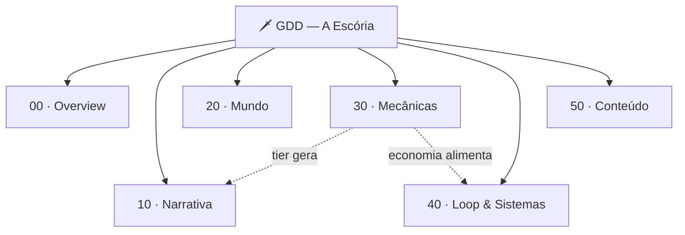

# GDD — A Escória

> 🧭 **Referência de design.** Este GDD guarda **intenção, restrição e o porquê** — narrativa, mundo, personagens, mecânicas de jogo, tom e conteúdo. Regras numeradas e testáveis, specs de entrega, decisões de arquitetura, tarefas e código vivem no **repositório**.
> 

> O filtro que separa os dois: *se eu trocasse a linguagem e a plataforma, isso continuaria valendo?* Se sim, é GDD.
> 

> Página de apoio: **Consolidado — Cânone v1.0**, a ata de decisões que fundou este documento.
> 

> Codinome: **Outlander** · Título: **A Escória** · Gênero: **MMORPG idle** (gear-based)
> 

Documento de design **vivo**, dividido por disciplina. Comece pelo **High Concept** e siga o mapa.

## 🧭 Mapa do GDD

## Nomenclatura oficial

- **Codinome interno:** `Outlander`
- **Título:** **A Escória** (trabalho **e** comercial)
- **Sistema de progressão:** **A Litania** (nunca "Destiny Board")
- **3 linhas de arma (PoC):** Guerreiro · Caçador · Conjurador
- **Nomes legados, não usar:** Deuses-Armas, Albion Idle
- **Têmpera** — multiplicador efêmero por arma equipada; o diferencial mecânico do projeto

## ⚖️ Escopo de lore (revisão de 06/09/2026)

Albion é sandbox e tem quase nenhuma história — de propósito, porque sandbox precisa de vazio para o jogador preencher. Este projeto adota a mesma disciplina.

**A lore existe para justificar que o equipamento venha em famílias que se odeiam, e nada além disso.**

- Cânone completo do universo: *10 · Narrativa → Premissa & Regras do Mundo*. Uma página, seis regras.
- Lore é **puxada, não empurrada**: escreve-se quando uma fatia precisa, do mesmo jeito que o código. Nada de escrever o panteão antes de implementar a Carcaça.
- Teste antes de canonizar qualquer coisa: *se o jogador nunca ler isto, ele joga pior?* Se não, é hobby, não é GDD.
- **Premissa atual:** os deuses estão vivos e em guerra fria por fiéis; o equipamento é o altar deles e usar é o culto. O Incrédulo, a Calcificação e o Silêncio estão **parqueados**, não deletados.

## Seções

As páginas abaixo são filhas desta — seis disciplinas mais três de apoio.

- **00 · Overview** — o que é o jogo (High Concept, Pilares, Glossário)
- **10 · Narrativa** — história e como ela é contada
- **20 · Mundo** — A Escória, facções, bestiário, geografia
- **30 · Mecânicas** — gear, tiers, combate, A Litania, Têmpera, Lastro, crafting, PvP
- **40 · Loop & Sistemas** — core loop e metagame
- **50 · Conteúdo** — os criativos: armas, skills, mobs, diálogos
- **Consolidado — Cânone v1.0** — a ata de decisões que fundou este GDD
- **Escopo da PoC** — o que entra e o que fica de fora do primeiro corte
- **Placeholders de Conteúdo** — índice dos nomes ainda não definidos

## 🔗 Onde as coisas vivem

- **Este Notion** — design: narrativa, mundo, mecânicas, conteúdo, tom.
- **Repositório** — regras numeradas (`R-XXX-NN`), specs de entrega, ADRs, tarefas, dados e código.
- **Livro de Imersão** — o mundo em prosa contínua, para leitura ou escuta.

[00 · Overview](GDD%20%E2%80%94%20A%20Esc%C3%B3ria/00%20%C2%B7%20Overview%203840b63b76f2818f9fdfc7eb163fd6f2.md)

[10 · Narrativa](GDD%20%E2%80%94%20A%20Esc%C3%B3ria/10%20%C2%B7%20Narrativa%203840b63b76f28109bf8fd28ffbfcf82f.md)

[20 · Mundo](GDD%20%E2%80%94%20A%20Esc%C3%B3ria/20%20%C2%B7%20Mundo%203840b63b76f2817b8a39eff4c7c2f4d5.md)

[30 · Mecânicas](GDD%20%E2%80%94%20A%20Esc%C3%B3ria/30%20%C2%B7%20Mec%C3%A2nicas%203840b63b76f281bba0b5cb76b9efc5b1.md)

[40 · Loop & Sistemas](GDD%20%E2%80%94%20A%20Esc%C3%B3ria/40%20%C2%B7%20Loop%20&%20Sistemas%203840b63b76f28107986ad3dadf6c9a3c.md)

[50 · Conteúdo](GDD%20%E2%80%94%20A%20Esc%C3%B3ria/50%20%C2%B7%20Conte%C3%BAdo%203840b63b76f281b88467ed0f056c0cef.md)

[Consolidado — Cânone v1.0](GDD%20%E2%80%94%20A%20Esc%C3%B3ria/Consolidado%20%E2%80%94%20C%C3%A2none%20v1%200%203840b63b76f281b99765fbdaea1b7682.md)

## 🎨 Diagramas (Whimsical)

Visões complementares ao texto deste GDD.

- [Core Gameloop](https://whimsical.com/UFJ77XVzRSv5TniEjxv7Pi) — o ciclo de sessão: zona → ação → recurso e Fama → progressão
- [Fluxo do Tutorial (8 passos)](https://whimsical.com/4Uhkq6YheWW8wuLmAyjW9h) — narrativa × mecânica de cada passo
- [Fluxo Narrativo](https://whimsical.com/AhpwzaocVbDSoa3w7zb8Vt) — as três camadas: Prévio → Jogado → Ganchos

[Escopo da PoC](GDD%20%E2%80%94%20A%20Esc%C3%B3ria/Escopo%20da%20PoC%203840b63b76f2817e86d4e0340d15afd0.md)

[Placeholders de Conteúdo (PH_*)](GDD%20%E2%80%94%20A%20Esc%C3%B3ria/Placeholders%20de%20Conte%C3%BAdo%20(PH_%20)%203a90b63b76f281fd9d87e5e9c65dbb85.md)

[🎨 Manual de Direção de Arte — A Escória](GDD%20%E2%80%94%20A%20Esc%C3%B3ria/%F0%9F%8E%A8%20Manual%20de%20Dire%C3%A7%C3%A3o%20de%20Arte%20%E2%80%94%20A%20Esc%C3%B3ria%203d20b63b76f281deb89acb0b73508928.md)