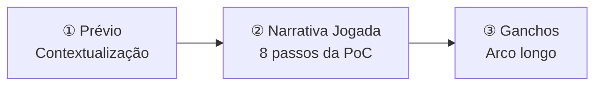

# 10 · Narrativa

A história e como ela é contada. Três camadas: **Prévio** (ambienta) → **Narrativa Jogada** (PoC) → **Ganchos** (arco longo).

Documentos: Narrativa Overview · Prévio/Ambientação · Narrativa Jogada (PoC) · Ganchos · Premissa & Regras do Mundo · Personagens · Tom & Estilo.

> ⚖️ **Lore mínima.** O cânone inteiro do universo cabe em *Premissa & Regras do Mundo*. Se não está lá, não é cânone. Lore nova só se escreve quando uma fatia de conteúdo precisa dela — puxada, nunca empurrada. Teste: *se o jogador nunca ler isto, ele joga pior?*
> 

[Narrativa — Overview](10%20%C2%B7%20Narrativa/Narrativa%20%E2%80%94%20Overview%203840b63b76f2816c914cee545d71aabd.md)

[Prévio — Ambientação do Player](10%20%C2%B7%20Narrativa/Pr%C3%A9vio%20%E2%80%94%20Ambienta%C3%A7%C3%A3o%20do%20Player%203840b63b76f281a7a07ed7b74587a63c.md)

[Narrativa Jogada — PoC (8 passos)](10%20%C2%B7%20Narrativa/Narrativa%20Jogada%20%E2%80%94%20PoC%20(8%20passos)%203840b63b76f281b49a40e14214531311.md)

[Ganchos de Arco Longo](10%20%C2%B7%20Narrativa/Ganchos%20de%20Arco%20Longo%203840b63b76f2817cb464e9656974acea.md)

[Premissa & Regras do Mundo](10%20%C2%B7%20Narrativa/Premissa%20&%20Regras%20do%20Mundo%203840b63b76f2818c8a7af00260e2ad21.md)

[Personagens](10%20%C2%B7%20Narrativa/Personagens%203840b63b76f2816b93b0feda8a7a7bf1.md)

[Tom & Estilo](10%20%C2%B7%20Narrativa/Tom%20&%20Estilo%203840b63b76f281a1b3ecd19fc752beef.md)