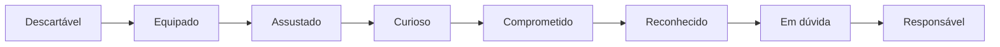

# Narrativa Jogada — PoC (8 passos)

A história que o player **vive**, costurada a cada beat mecânico do tutorial. Micro-arco: *chegar → receber → estranhar → entender → comprometer → reconhecer o outro → escolher → partir.*

```mermaid
sequenceDiagram
    actor C as O Catador (player)
    participant G as O Guia
    participant W as A Arma
    participant E as A Escória
    C->>E: Desembarca (a ruptura o cuspiu aqui)
    G-->>C: "Mais um." (Passo 1)
    G->>C: Entrega arma T1 (Passo 2)
    C->>W: Primeiro combate (Passo 3)
    W-->>C: O corpo acerta um golpe que a mente não mandou
    C->>E: Coleta materiais que não existem fora daqui (Passo 4)
    C->>W: Forja T1 para T2 com material + Lastro (Passo 5)
    Note over C,G: Passo 6 — outro portador: as armas se reconhecem
    C->>C: Acha a 2a arma; a 1a esfria, mas a Fama dela fica dormindo (Passo 7)
    G-->>C: "O que você carrega escolhe com quem se alinha" (Passo 8)
    C->>E: Caminho para fora se abre
```

## Os 8 passos

1. **Chegada** — *"Mais um."* O Guia não se surpreende. (zonas/navegação)
2. **A primeira arma** — o Catador chega de mãos vazias; o Guia empresta uma **T1 de sucata, sem dono**. Ferramenta, não dádiva, e nenhum deus atrás dela ainda. (equipar, ver Q/W/E)
3. **O corpo que age sozinho** — *"eu fiz isso, ou alguém me deu uma mão?"* Primeiro favor, pequeno e negável. (auto-battler, fila)
4. **A Escória dá o que não existe** — lugar estranho e generoso. (coleta por zona)
5. **A forja** — *material faz a lâmina; Lastro faz continuar lâmina; Fama faz lembrar como se usa.* **A primeira T2 é o momento em que um deus repara nele pela primeira vez** — pequeno, sem nome, do fim da fila. Introduz a **Têmpera**: bater na mesma arma esquenta; trocar esfria. (craft, Lastro, Têmpera, T1→T2)
6. **O outro portador** — *"Sua arma tem gosto. Cuidado quando começar a ter voz."* (social, facções)
7. **A segunda arma escondida** — de outro panteão. A primeira esfria, mas a Fama dela permanece dormindo (nada se perde). Primeira escolha de identidade: espalhar-se entre panteões ou enraizar-se num. Ninguém o obriga a jurar — ser escória é justamente poder servir a dois de uma vez. A cobrança só vem no T4. (loadout, Têmpera, pureza vs. mistura)
8. **A saída** — *"o que você carrega escolhe com quem você se alinha. E eles já repararam."* (fim do tutorial)

## Mapa emocional

