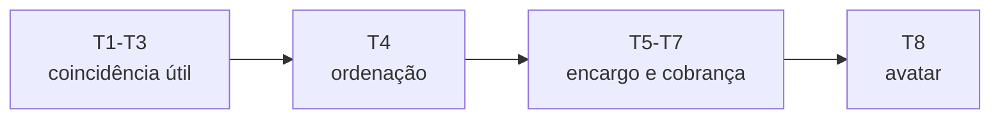

# Tom & Estilo

Regras de voz para todo texto: lore, falas, descrições de item, logs de combate.

## A voz do mundo

- **Registro:** oral, gasto, pragmático. Campo semântico de metalurgia (forja, escória, lastro, liga, têmpera).
- **Sem grandiloquência divina.** Fala-se de deus como se fala de patrão distante e mal-humorado: com cautela, ironia e cálculo.
- **Atemporal:** sem marcadores de época. A "era" é dada pelo tier.

## Disputa, não luto

Regra de tom nova, e a mais importante desta página.

O mundo não está acabando: está **em campanha**. Há propaganda, deserção, aliança de conveniência, mesquinharia divina e humor seco. Um deus perdendo fiéis é patético antes de ser trágico.

**Não termine toda seção em derrota.** Tom sombrio funciona por contraste — Dark Souls tem fogueira. Se um texto não tem nada de bom, engraçado ou generoso, ele não está sombrio, está monótono.

Teste rápido: *o que é bom neste mundo?* Todo texto longo precisa responder pelo menos uma vez.

## Insinuar, não explicar (Pilar 4)

| Evitar | Preferir |
| --- | --- |
| "Você usou Corte Ascendente." | "seu braço antecipou o golpe antes de você decidir." |
| "Esta arma contém o deus X." | "a lâmina lembra de uma forja que você nunca visitou." |
| "As facções estão em guerra." | um portador é recebido com pão; outro, com lâmina à mostra. |
| "Você ganhou favor de X." | "alguém, em algum lugar, anotou que você existe." |

## Comunicação por tier

- **T1–T3** — favor pequeno e negável. A peça facilita e você chama de sorte.
- **T4 — ordenação.** Você deixa de ser usuário e vira representante. Não é possessão: é **carreira**. Ganha acesso, ganha inimigo, e o mundo passa a te tratar pelo que você veste.
- **T5–T7** — o deus cobra. Pede alvos, pede presença, pede exclusividade.
- **T8 — avatar.** Caro e irreversível. Não é doença; é o topo de uma carreira que quase ninguém quer.

Descrições de habilidade e logs **mudam levemente quando o tier sobe**. Trocar de arma muda o tom das mensagens.

## Léxico

- **Usar:** Escória, Margem, Carcaça, Encruzilhada, Litania, Lastro, Fama, favor, portador, juramentado, sucateiro, liga, têmpera, gosto, altar, culto, ordenação.
- **Evitar:** "épico", "escolhido", "destino", "Destiny Board" (use **Litania**), "possessão", "maldição", e jargão de game ("buff", "DPS", "multiplicador") em texto diegético.

> **Nota — dois sentidos de "têmpera".** (1) *Metafórico/diegético:* o estado de "estar quente / esfriar" que o Guia e os textos usam livremente. (2) *Mecânico:* a **Têmpera** é o multiplicador efêmero por arma equipada — ver *A Litania & Fama*. Regra de voz **híbrida**: o termo técnico só escapa na boca de personagens em momentos de peso. No tutorial, uma única vez (Passo 7).
> 

> **Nota — mistura de panteões.** Na voz do mundo, loadout misto não é "build". É a marca de quem não jurou nada. Juramentado olha para isso com desprezo e com um pouco de inveja.
>