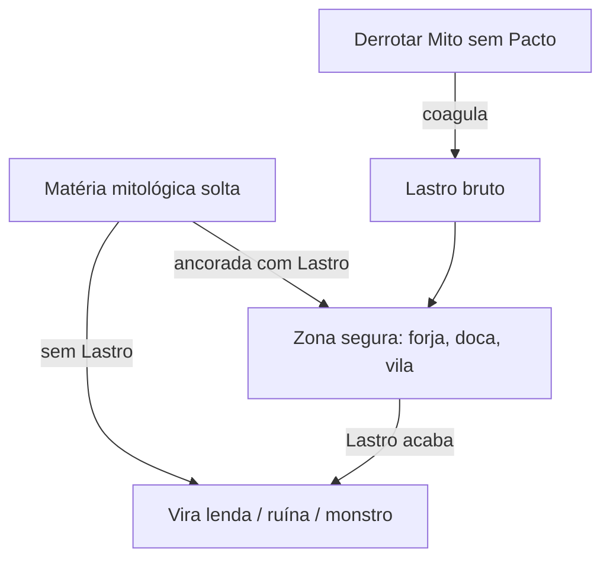

# A Escória

O lugar onde o jogo acontece (cânone A4).

## O que é

Quando os universos dos panteões ruíram, os deuses se esconderam no metal "puro" (as armas). O rejeito — ilhas isoladas, ruínas de civilizações misturadas, matéria sem dono — formou um lixão cósmico: **A Escória**.

## Por que é o campo de batalha

Não foi construída para a guerra. Virou campo **por padrão**: é o único lugar **neutro**, onde nenhum panteão tem vantagem de terreno. Os deuses fracos convergiram seus portadores para cá.

## Física do lugar

> *"Aqui, até chão firme custa."* Manter qualquer pedaço estável consome Lastro continuamente.
> 

## Os dois nomes

| Quem fala | Nome |
| --- | --- |
| Catadores, guias, portadores | **A Escória** |
| Acadêmicos, cultistas | **O Interstício** |
| Facções religiosas | nomes próprios regionais (Fase 2) |

## Geografia macro (Chat 0 — cânone)

A Escória **não é só a ilha tutorial** — é o mapa inteiro do jogo. Estrutura:

| Camada | O que é |
| --- | --- |
| **A Margem** | Borda neutra; onde os recém-caídos chegam. PoC fica aqui. |
| **A Margem Calada** | A ilha tutorial — um caco recente da Margem. |
| **As Carcaças** | Interior. Cada uma = cadáver de um mundo-panteão. Pós-PoC. |
| **As Encruzilhadas** | Rede neutra entre Carcaças; futuras dungeons-panteão. |
| **A Forja Calada** | Cidade neutra (capital). Pós-PoC. |
| **A Fome** | Profundezas/endgame; Mitos sem Pacto mais fortes. |

**Carcaças canônicas:** Pálida (nórdica) · Solar (egípcia) · Reverenciada (grega) · Trovejada (eslava) · Tropical (folclore sul-americano).

> A diversidade mitológica está **no mapa**, descoberta (Pilar 4). Cada **Encruzilhada** é o vestíbulo do núcleo de uma **Carcaça** — porta natural para o sistema futuro de viajar para dentro do universo de um panteão específico.
>