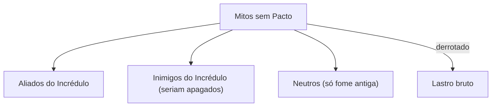

# Bestiário — Mitos sem Pacto (Fase 2)

Conceito fechado (A3); criaturas concretas são Fase 2.

## O que são

Criaturas, maldições e presságios de **todas as tradições** que perderam contenção quando os deuses recuaram. A fauna do caos mitológico.

## Regras

- **Não são exército do Incrédulo.**
- Quanto mais caos, mais fortes.
- Ao morrer, parte da instabilidade **coagula em Lastro bruto**.

## Eixos de design (como criar um mob)

Tradição de origem · Postura vs. Incrédulo · Domínio de caos · Função no combate · Drop de Lastro.

> Mobs do Albion ("Hereges", "Raposas") são placeholders legais a reescrever como Mitos sem Pacto na Fase 2.
>