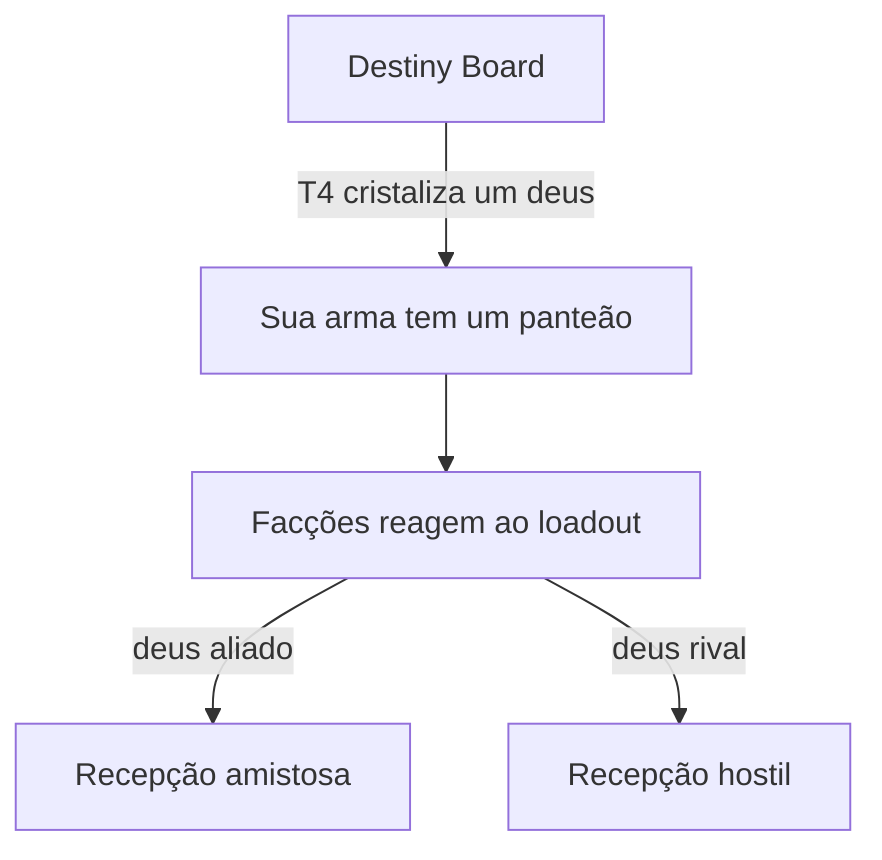
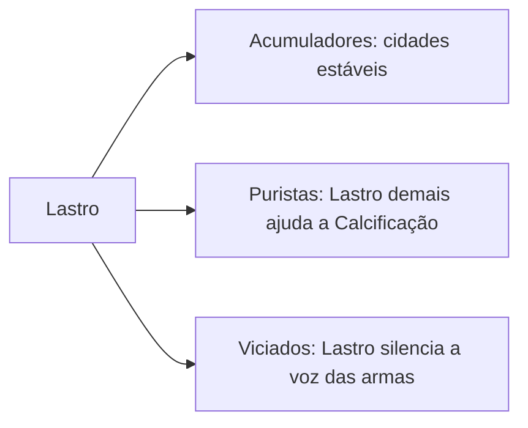

# Facções & Panteões

Facções **não** são política genérica: são **culturas organizadas em torno de panteões**. A guerra delas é o reflexo externo da disputa dentro do equipamento do player (Gancho 3).

## A guerra começa no Destiny Board (A11)

## Os panteões

Múltiplas mitologias mapeáveis em biomas: **nórdico, egípcio, grego, eslavo, sul-americano/folclore brasileiro**. Cada um ressoa um "sabor" (ruído difuso em T1–T3), cristaliza em deuses no T4, e tem deuses que **sabem** e que **não sabem** do Pacto (B3).

## Como as armas são tratadas

Oficialmente **sagradas ou proibidas**; na prática, **inevitáveis** — como material radioativo. Todo mundo sabe que se envenena, mas é isso ou ser estraçalhado pelos Mitos sem Pacto.

## Posturas sobre o Lastro (gancho)

## Arquétipos (Fase 2)

Atravessadores (agiotas de almas) · Ordem doutrinária (armas sagradas) · Cultura de panteão ascendente · Cultistas do Interstício (servem ao Incrédulo sem saber).