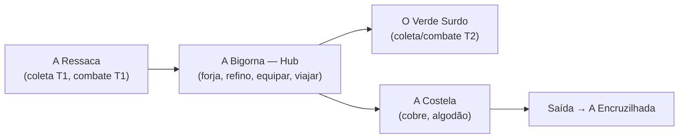
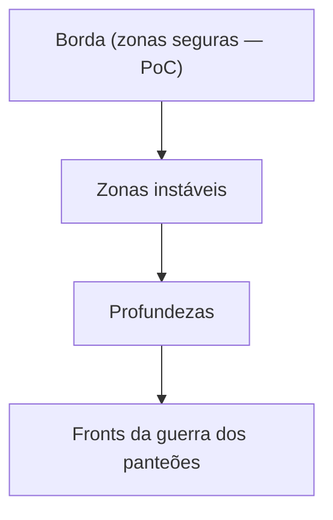

# Geografia & Zonas (Fase 2)

> ✅ **Cânone (Chat 0):** A Escória **é o mapa inteiro do jogo** — não só a ilha. Ilha tutorial = **A Margem Calada** (um caco da Margem).
> 

## Geografia macro de A Escória

```
A ESCÓRIA (mapa todo — o universo paralelo entre panteões)
├── A MARGEM — borda neutra (entrada; PoC fica aqui)
│   └── A Margem Calada — a ilha tutorial
├── AS CARCAÇAS — interior; cada uma é o cadáver de um mundo-panteão
│   ├── Carcaça Pálida (motivos nórdicos)
│   ├── Carcaça Solar (motivos egípcios)
│   ├── Carcaça Reverenciada (motivos gregos)
│   ├── Carcaça Trovejada (motivos eslavos)
│   └── Carcaça Tropical (folclore sul-americano)
├── AS ENCRUZILHADAS — rede neutra entre Carcaças (futuras portas para dungeons-panteão)
├── A FORJA CALADA — cidade neutra (capital de fato; pós-PoC)
└── A FOME — profundezas/endgame
```

> A diversidade mitológica está **no mapa**, descoberta (Pilar 4). Cada **Encruzilhada** é o vestíbulo do núcleo de uma **Carcaça** — porta natural para a futura viagem ao universo de um panteão específico.
> 

---

Geografia macro é Fase 2. A ilha tutorial (PoC) já está especificada.

## Princípio: zona define ação (Pilar 3)



> Nomes ("A Ressaca", "A Bigorna", etc.) são **placeholders legais** herdados do Albion. Fase 2 reescreve a fantasia mantendo a topologia.
> 

## Zonas da PoC

| Zona (placeholder) | Tier | Recursos | Ações |
| --- | --- | --- | --- |
| A Ressaca | 1 | Tronco/Pedra Bruta | Coletar, Matar |
| A Bigorna (Hub) | — | — | Craftar, Refinar, Equipar, Viajar |
| O Verde Surdo | 2 | Bétula, Couro | Coletar, Matar, Viajar |
| A Costela | 2 | Cobre, Algodão | Coletar, Matar, Viajar |

## Camadas macro (Fase 2)

