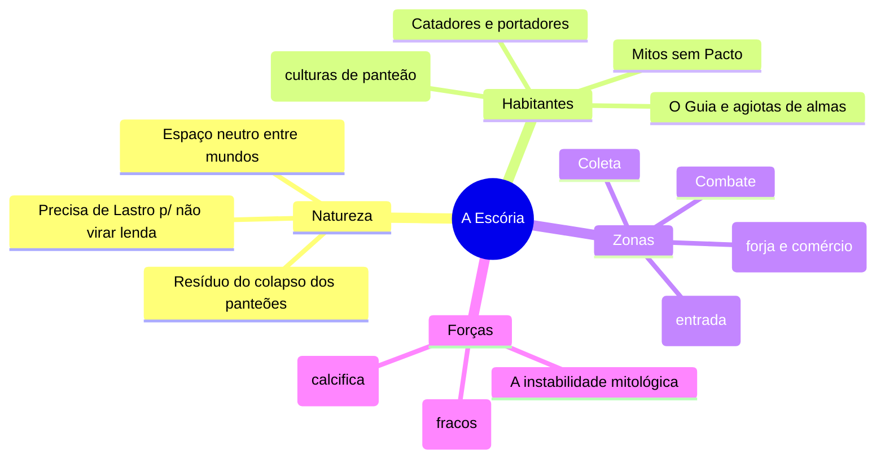

# Mundo — Overview

O mundo é **A Escória** — o resíduo entre os universos dos panteões. **Atemporal por design** (a "era" é dada pelo tier).

## Princípios do mundo

1. **Lugar = ação** (Pilar 3).
2. **Estabilidade custa** Lastro (sem Lastro, a realidade degrada).
3. **Atemporalidade.**
4. **Dois vocabulários:** A Escória (rua) vs. Interstício (acadêmico).

A PoC inteira acontece na **ilha tutorial**, uma zona segura da borda.