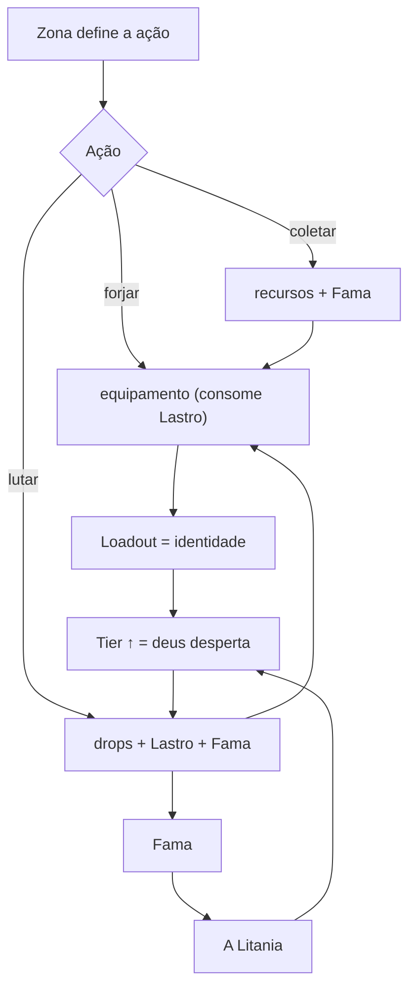

# 30 · Mecânicas

As regras (âncoras inegociáveis; a narrativa se adapta a elas).

Documentos: Mecânicas Overview · Gear = Identidade · Tiers & Manifestação · **Armaduras — Slots e Sets** · Combate Auto-battler · A Litania & Fama · Economia (Lastro) · Crafting & Coleta · **PvP, Gank e Risco** (pós-PoC).

[Mecânicas — Overview](30%20%C2%B7%20Mec%C3%A2nicas/Mec%C3%A2nicas%20%E2%80%94%20Overview%203840b63b76f28173b1f4e6121ae4ab94.md)

[Gear = Identidade](30%20%C2%B7%20Mec%C3%A2nicas/Gear%20=%20Identidade%203840b63b76f2815babb1d5e134842e14.md)

[Tiers & Manifestação](30%20%C2%B7%20Mec%C3%A2nicas/Tiers%20&%20Manifesta%C3%A7%C3%A3o%203840b63b76f28175b0c5dc0f8b5408f2.md)

[Combate — Auto-battler](30%20%C2%B7%20Mec%C3%A2nicas/Combate%20%E2%80%94%20Auto-battler%203840b63b76f2815f919ae7bd18d6b5df.md)

[A Litania & Fama](30%20%C2%B7%20Mec%C3%A2nicas/A%20Litania%20&%20Fama%203840b63b76f281f1a2a2c8677a661f84.md)

[Economia — Lastro](30%20%C2%B7%20Mec%C3%A2nicas/Economia%20%E2%80%94%20Lastro%203840b63b76f28156b4e0e1e3d7bb3b37.md)

[Crafting & Coleta](30%20%C2%B7%20Mec%C3%A2nicas/Crafting%20&%20Coleta%203840b63b76f2816c9595dc0f57b97976.md)

[PvP, Gank e Risco](30%20%C2%B7%20Mec%C3%A2nicas/PvP,%20Gank%20e%20Risco%203be0b63b76f281e9a830f6271bacc471.md)

[Armaduras — Slots e Sets](30%20%C2%B7%20Mec%C3%A2nicas/Armaduras%20%E2%80%94%20Slots%20e%20Sets%203d40b63b76f281f69017fa4b7350ecd8.md)