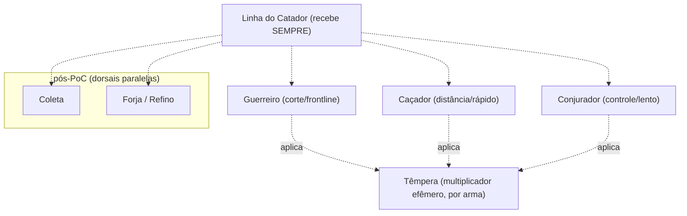

# A Litania & Fama

Cânone fixo 5. **A Litania** — árvore de progressão por **uso** e **lembrança**: a recitação que desperta o deus *e* a lista que o cataloga (duplo sentido). Internamente inspirada no *Destiny Board* do Albion, mas no jogo **nunca** se diz "Destiny Board" — diz-se **A Litania**. **Fama** = moeda de progressão (diegese: "lembrança"). Separada do Lastro.

## As 3 camadas da progressão

A Litania acumula em três camadas independentes. **As duas primeiras seguem o modelo Albion; a Têmpera é o diferencial do projeto.**

| Camada | O que é | Cresce com | Reseta? |
| --- | --- | --- | --- |
| **Linha do Catador** (espinha dorsal) | Recitação central; sobe a Litania como um todo. Equivale ao *Adventurer* do Albion. | Qualquer ação na Escória (combate, coleta, forja, exploração) | Nunca |
| **Linha de cada arma** | Recitação do deus latente daquela arma. Na PoC: Guerreiro / Caçador / Conjurador. | Só com aquela arma equipada | Nunca |
| **Têmpera** | Multiplicador efêmero de ganho da arma equipada agora. | Uso ativo e contínuo da **mesma** arma | **Só na troca de arma** |

## Têmpera (diferencial do projeto)

- **O que faz:** multiplica o ganho de Fama (Catador + Arma) da arma equipada. Partida sugerida: 1.0x → 1.5x ao longo de *N* ações ressonantes (número final = balanceamento). **Não** altera dano.
- **Sobe:** com ações ativas da mesma arma (kills, ciclos completos, ações certas na zona certa), até um cap.
- **Congela offline:** com o jogo fechado não cresce nem decai. O player volta exatamente onde deixou.
- **Reseta:** apenas ao trocar a arma equipada. Nada do acumulado (Fama das camadas 1 e 2) se perde — Têmpera é **custo de oportunidade, não punição**.
- **Escopo:** **por arma na PoC**; pós-PoC evolui para **por loadout** (arma + off-hand + armadura coerentes maximizam; trocar uma peça reduz parcialmente). **Armadura existe na PoC, mas ainda não carrega Têmpera.**
- **Por que existe:** recompensa **presença ativa** sem punir ausência — sustenta o pilar "idle com peso". Diegese: é a estratégia do Guia para fugir da cristalização (nunca deixa a têmpera "maturar até o fim"). Ver *Diálogos do Guia*, Passo 7.

## Distribuição de Fama

Toda ação alimenta **duas** camadas ao mesmo tempo: a Linha do Catador (sempre) e a linha da arma/nó relevante.

1. **Linha do Catador** recebe sempre.
2. **Combate:** Fama para a arma equipada (a de maior dano no loadout).
3. **Coleta:** Fama para o nó do recurso.
4. **Craft/Refino:** Fama para o nó da estação.
5. **T4+:** split 20%/80% com Learning Points (fora da PoC; estrutura já suporta).

Em todos os casos, a Fama ganha é multiplicada pela **Têmpera** atual da arma equipada.

## Fama = lembrança (e Enumeração)

Cada nó destravado é um deus mais lembrado — e mais **catalogado**. A Litania do player **é** uma forma de Enumeração: avançar restaura *e* aprisiona o divino. É exatamente isso que o Guia alimenta sem perceber.

## Mapa de guerra (Gancho 3)

No T4, cada ramo tem origem em um **panteão distinto**, e facções reagem a isso. A guerra está na árvore.

## Fama base (PoC)

Valores por ação **antes** da Têmpera (que é aplicada como multiplicador em cima destes).

| Ação | Tier | Fama |
| --- | --- | --- |
| Coletar | T2 | 2 |
| Coletar | T3 | 4 |
| Refinar | T3 | ~11 |
| Matar mob | T2 | ~15-30 |