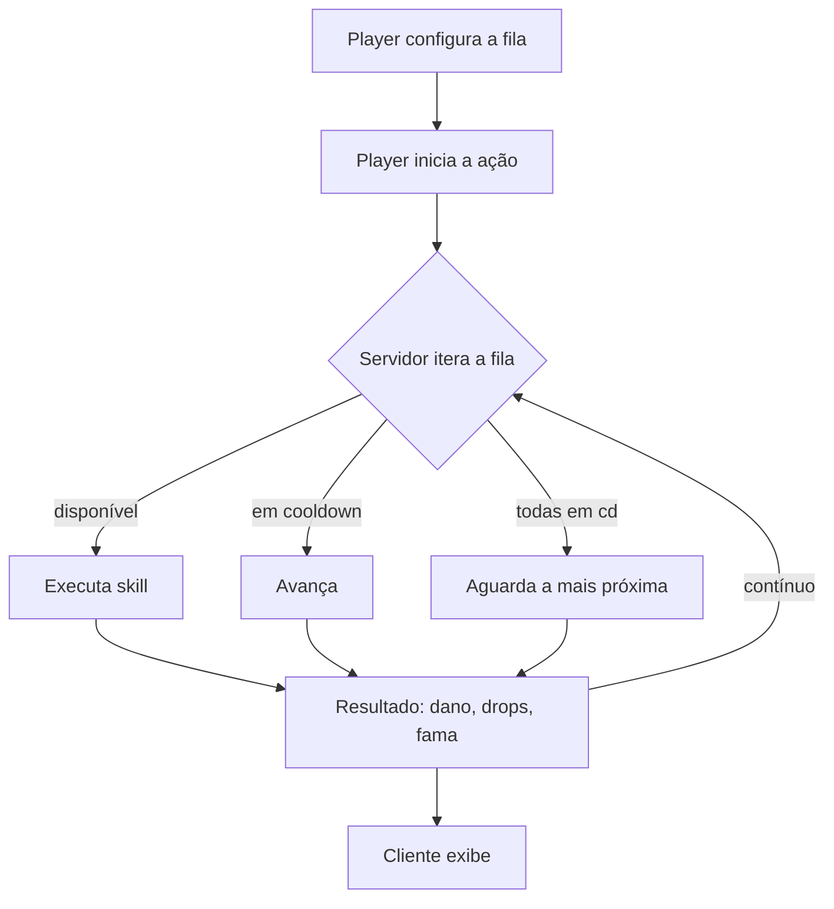

# Combate — Auto-battler

Cânone fixo 6. Combate **automatizado** com fila de habilidades. **O servidor é a autoridade** — o jogador monta a fila e assiste; não executa golpes.

## Slots (por arma)

- **Q/W** — escolha entre opções; **E** — fixo; **Auto-attack** — cd ~1-1.5s, tratado como skill.
- Armaduras adicionam skills à fila. Trocar peça remove as skills dela; o player reconfigura.

## Fama por crédito de dano

Em combate, a Fama vai para a **peça com maior contribuição de dano**. Diegese: o deus que mais trabalhou é o mais lembrado.

## Camada narrativa (logs escalam por tier)

| Tier | Log |
| --- | --- |
| T1 | *"seu braço antecipou o golpe antes de você decidir."* |
| T3 | *"a lâmina puxou primeiro; você só seguiu."* |
| T6 | *"vocês dois escolheram o mesmo alvo."* |

> PvP e gank: registrados, **fora da PoC**.
>