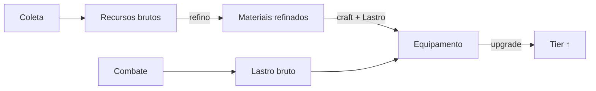

# Crafting & Coleta

Cânone fixo 7 + A7. PoC: crafting **instantâneo, sem Focus**.

## Coleta

Ação depende da **zona**. Recursos têm tier. Gera recurso **+ Fama** do nó. Limitadores: *slots* e *peso*. Limite atingido → interrompe no fim do ciclo (`inventory_full`).

## Cadeia de produção

## A tríade (Passo 5)

> **Material faz a lâmina. Lastro faz a lâmina continuar sendo lâmina. Fama faz a coisa dentro dela lembrar como se usa uma lâmina.**
> 

## Vínculo narrativo

Craftar é **forçar uma arma divina a aceitar uma forma**. Tier maior resiste mais — daí o custo crescente de Lastro. A forja é uma pequena negociação com o deus latente.

## Estações (PoC)

Forja Improvisada (T1), Warrior's Forge, Hunter's Lodge, Mage's Tower, Smelter, Tanner, Lumbermill, Weaver. Nomes a revisar na Fase 2.