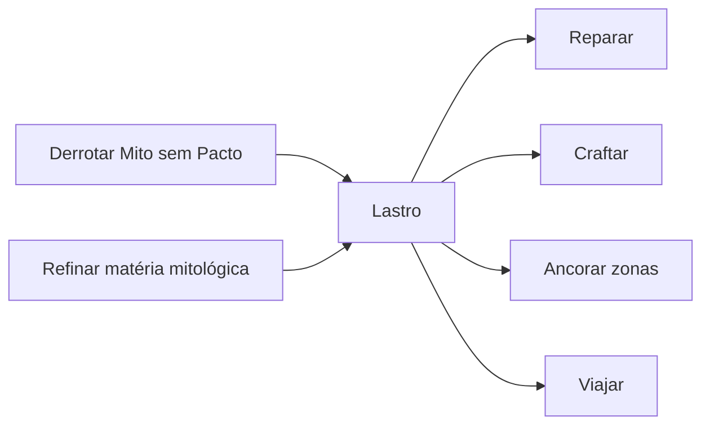

# Economia — Lastro

Cânone A7. **Lastro** é a moeda corrente (o "ouro/prata"). **Separada da Fama.**

## O que é

Resíduo **estável e neutro** que sobra quando matéria mitológica é quebrada, morta ou refinada. Não pertence a nenhum panteão, não é sagrado, não canta. Por isso todo mundo aceita.

## Por que tem valor

1. **Estabiliza realidade** (zonas seguras precisam dele).
2. **Repara e refina** (segura a forma contra a "vontade" da arma).
3. **É neutro entre facções.**

## A regra que separa os eixos

> Matar um mob com espada T2 rende **Fama de espada T2** (Destiny Board) **e** **Lastro** (moeda). Nunca embolar.
> 

*"Guarde essas lascas. Aqui, até chão firme custa."*

## A ironia moral

A economia de quem luta contra o Incrédulo depende de **realidade calcificada** — miniatura do mundo que ele quer. Facções divergem (acumular / purismo / vício).