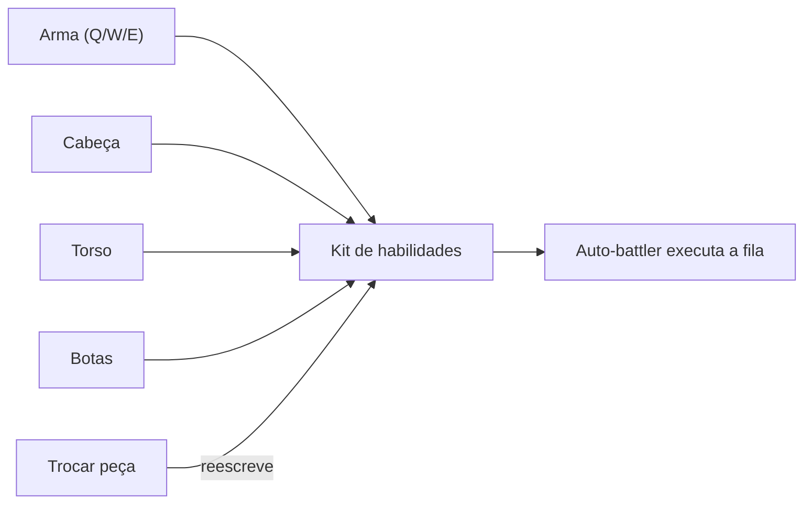
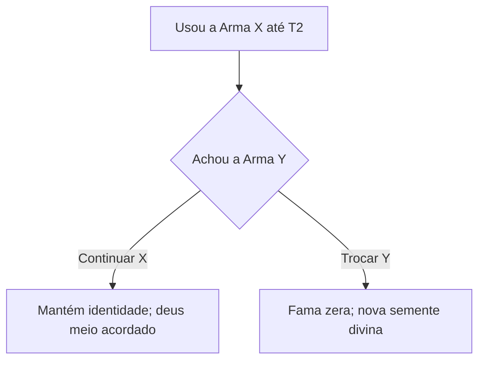

# Gear = Identidade

Cânone fixo 1 e 3.

## Regra

A identidade mecânica é **100% o loadout**. Não há classe. Trocar de arma = trocar de identidade e de qual deus você carrega.

## Habilidades vêm do item

O personagem **não aprende nada permanentemente** — usa o que a peça permite. Implicação narrativa: as habilidades **são o deus manifesto**. O personagem não domina técnicas; sobrevive ao fato de a técnica passar por ele.

## Custo de identidade (Passo 7)

A Fama é acumulada **por linha de arma**. Trocar = começar do zero.

