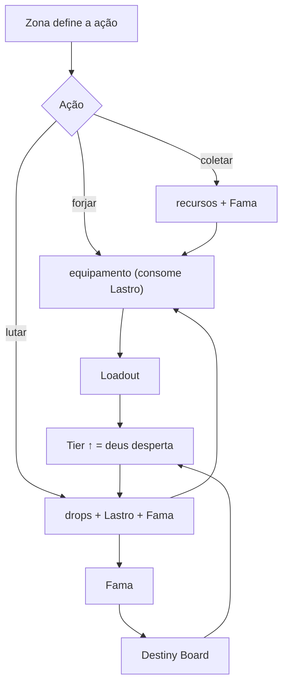
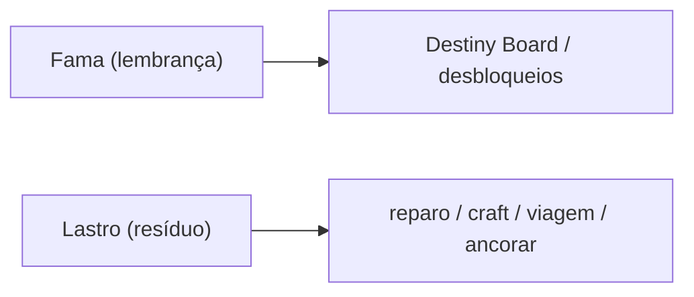

# Mecânicas — Overview

As mecânicas são **âncoras inegociáveis** (têm spec). A narrativa se adapta a elas.

## Duas moedas, dois eixos (não embolar)

Matar um mob com espada T2 rende **as duas coisas, separadas**: Fama de espada T2 **e** Lastro.

## Vínculo mecânica/narrativa

- Tier ↑ = o deus toma mais de você (Pilar 2).
- Fama = lembrança (mantém o deus vivo).
- Lastro = realidade calcificada (miniatura do mundo do Incrédulo).