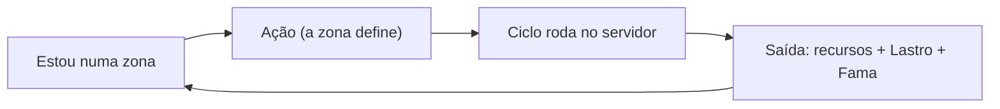
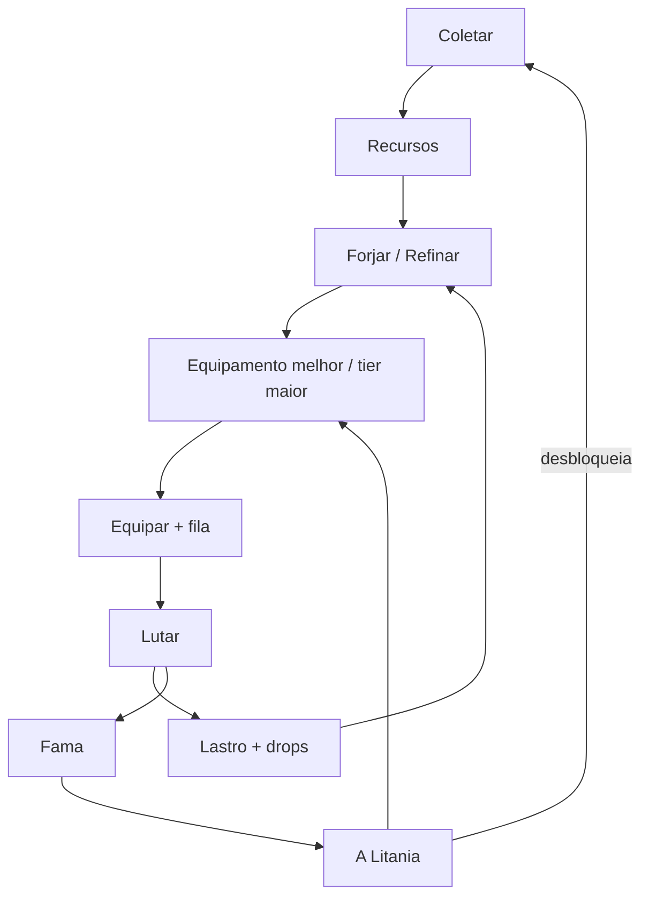
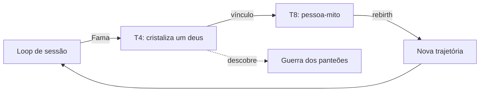

# Core Loop (Gameloop)

Três loops aninhados: **momento → sessão → meta**.

## Loop de momento

## Loop de sessão (o que o tutorial valida)

> *zona define ação → ação gera recurso/fama → fama progride A Litania → progressão desbloqueia novo conteúdo.*
> 

## Loop de meta

## Gatilhos de engajamento

1. Curiosidade da voz (o tier seguinte muda o que a arma diz).
2. Dilema de identidade (comprometer com uma arma e aprofundar vs. espalhar-se entre várias; ao trocar, a arma esfria — a Têmpera reseta — mas a Fama dela permanece). O custo real de ceder só cobra no T4.
3. Mistério descoberto (facções reagem ao loadout).