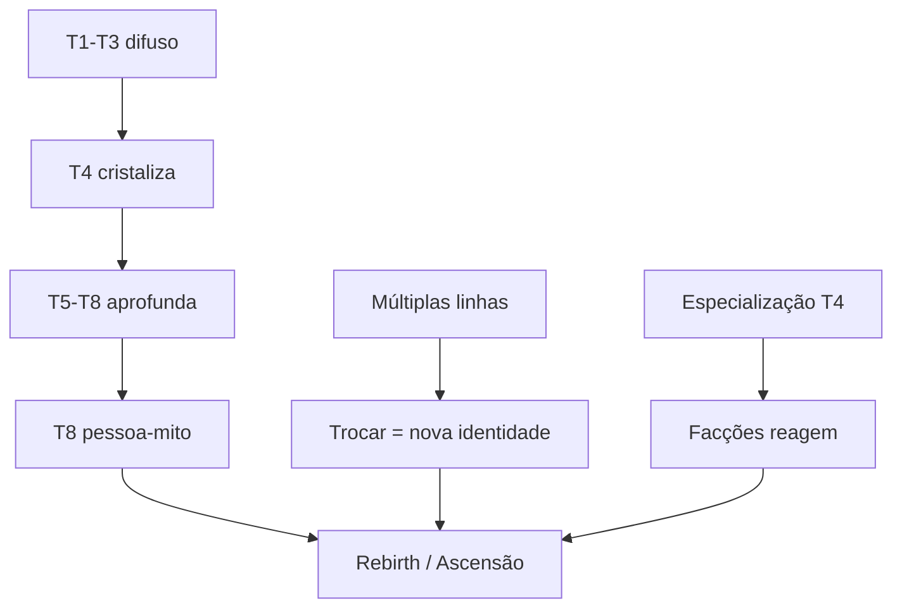

# Metagame

Progressão longa. **Fora da PoC**, mas pensada agora para o loop não nascer raso.

## Três motores

## T8 como gatilho de rebirth

No T8 nasce a **pessoa-mito**. Pode funcionar como prestígio/rebirth: o ciclo reinicia em outra trajetória, carregando algo da fusão. **Não é reset numérico vazio** — é deliberar o que o ser híbrido leva para a próxima existência.

> Em aberto (Fase 2/3): o que persiste no rebirth (memória do deus? fragmentos de Fama? acesso a panteões?).
> 

## Por que importa para o antagonista

A pessoa-mito é **incatalogável** — a primeira coisa que ameaça o Incrédulo.

## O que a PoC só **prepara**

- Destiny Board que suporte T4+ (split de Learning Points).
- Fama por linha de arma (custo de troca já faz sentido no Passo 7).
- Lastro como sink econômico extensível.