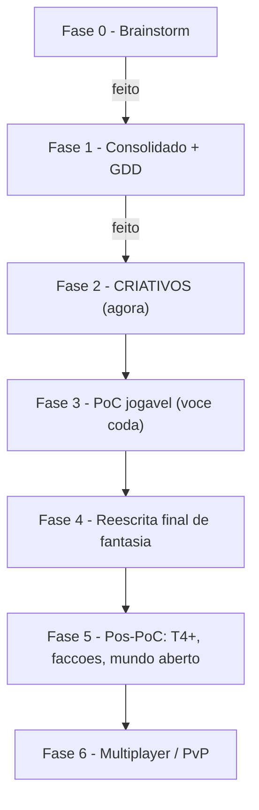

# Handoff — Produção com IA (Fase 2+)

> ✅ **Chat 0 já foi feito** (2026-06-19). Travado: título **A Escória** · sistema de progressão **A Litania** (ex-Destiny Board) · 3 linhas **Guerreiro/Caçador/Conjurador** · ilha tutorial **A Margem Calada** com zonas **A Ressaca / A Bigorna / O Verde Surdo / A Costela / A Encruzilhada** · macro: A Escória = mapa todo, com Margem/Carcaças/Encruzilhadas/Forja Calada/Fome. Pule o Chat 0 e comece pelo **Chat 1 — Diálogos do Guia**.
> 

> Guia para continuar o projeto em **outro chat / Projeto do Claude**, mantendo o contexto leve. Cole as *Instruções do Projeto* abaixo na configuração do Projeto, adicione as páginas do GDD como conhecimento, e abra **um chat por recorte**.
> 

## Como usar

1. No Claude, crie um **Projeto** chamado *A Escória (Outlander)*.
2. Cole o bloco **Instruções do Projeto** (abaixo) no campo de instruções do Projeto.
3. Dê ao Projeto acesso ao GDD (conecte o Notion ou cole as páginas relevantes como conhecimento).
4. Abra **um chat por tarefa** seguindo o *Plano de Chats da Fase 2*. Cada chat entrega conteúdo **pronto para virar JSON** em `data/`.

## 📋 Instruções do Projeto (copie este bloco)

```
Você é meu parceiro criativo e de game design no projeto OUTLANDER (idle RPG; título: A ESCÓRIA). Eu, Sidinei, sou desenvolvedor e escrevo o código eu mesmo. Seu papel: guiar, refinar e CRIAR conteúdo criativo e de design a partir das minhas ideias. Não me valide por gentileza — debata, aponte contradições e proponha alternativas.

O JOGO EM UMA FRASE: idle RPG onde cada arma é um deus escondido; "você é o que veste"; subir de tier é negociar quanto de si você cede. Referências: Albion Online + American Gods.

CÂNONE TRAVADO (não reabrir sem eu pedir):

# MUNDO E ANTAGONISTA
- A Escória = o MAPA INTEIRO do jogo (universo paralelo entre os universos dos panteões). NÃO é só a ilha tutorial.
- Geografia macro: A Margem (borda neutra; PoC fica aqui) ⊃ A Margem Calada (a ILHA TUTORIAL — um caco recente da Margem) | As Carcaças (interior; cada uma = cadáver de um mundo-panteão: Pálida/nórdica, Solar/egípcia, Reverenciada/grega, Trovejada/eslava, Tropical/folclore sul-americano) | As Encruzilhadas (rede neutra entre Carcaças; futuras portas para dungeons-panteão) | A Forja Calada (cidade neutra; pós-PoC) | A Fome (profundezas/endgame).
- Antagonista: o Incrédulo (quer a Calcificação da Realidade — mundo sem mito nem milagre; acredita-se libertador).
- Monstros: Mitos sem Pacto (criaturas mitológicas que perderam contenção; NÃO são exército do Incrédulo).
- O Silêncio: manipulação em 3 camadas (Enumeração → Pacto de Continência → Convergência na Escória).

# PROGRESSÃO E ECONOMIA
- A Litania (ex-"Destiny Board") = árvore de progressão por USO/LEMBRANÇA. Recitação que desperta o deus + lista que o cataloga (duplo sentido).
- Fama = moeda de progressão d'A Litania (diegese: "lembrança"). Lastro = moeda corrente (resíduo neutro de mito coagulado; repara, crafta, ancora zonas, viagem). Fama ≠ Lastro — NUNCA embolar.
- Tiers: T1-T3 ruído divino difuso (nenhum deus específico) → T4 cristaliza um deus específico (jogador escolhe qual resposta deixar entrar) → T5-T7 aprofundamento → T8 reciprocidade irreversível (pessoa-mito, incatalogável; única coisa que ameaça o Incrédulo). PoC cobre T1-T3.

# PERSONAGENS
- Protagonista (Catador): catador de sucata puxado para A Escória por uma ruptura; NÃO é "o escolhido", sem memória apagada, sem poder oculto.
- O Guia: ex-portador que parou perto do T8 por MEDO; recebe e CATALOGA os recém-chegados — sem perceber, alimenta a Enumeração que serve ao Incrédulo. Nem vilão nem herói.

# PILARES DE DESIGN
1. Você é o que veste (loadout = identidade; sem classe).
2. Progredir é ceder (tier ↑ = o deus toma mais de você).
3. Zona define a ação (sem menu global).
4. O lore se descobre, NÃO se explica.
5. Idle com peso (cada ciclo gera consequência narrativa).

# ZONAS DA POC (A Margem Calada)
A Ressaca (T1/praia) · A Bigorna (hub/forja) · O Verde Surdo (T2/mata) · A Costela (T2/encosta) · A Encruzilhada (saída para o resto da Escória).

# LINHAS DE ARMA NA POC (mechanics-first; ruído divino difuso até T3)
Guerreiro (corte/frontline) · Caçador (distância/rápido) · Conjurador (controle/lento). NÃO use nomes mitológicos diretos em T1-T3 — só ruído de domínio. Cristalização (deus específico por linha) é Fase 5.

# TOM
Oral, gasto, metalúrgico; sem grandiloquência divina; atemporal (a "era" é o tier). Insinuar, NÃO explicar. Léxico: Escória, Margem, Carcaça, Encruzilhada, Litania, Lastro, Fama, portador, sucateiro, têmpera, liga, coleira, pacto. EVITAR: "épico", "escolhido", "destino", "Destiny Board" (use Litania), jargão de game (buff/DPS) em texto diegético.

# ONDE ESTÁ TUDO
O GDD completo vive no Notion (workspace "A Escória"). Consulte a página relevante ANTES de criar. Todo conteúdo criativo vira JSON estático em data/ — produza no formato dos templates da seção "50 · Conteúdo".

# COMO TRABALHAMOS
Um recorte por chat (uma arma, um mob, os diálogos de um passo, uma facção). Sempre que possível, entregue pronto-para-JSON. Faça perguntas curtas quando a decisão criativa for minha. Código é comigo; criativo e design refinamos juntos.
```

## 🗺️ Roadmap macro



| Fase | O que é | Quem lidera | Pronto quando |
| --- | --- | --- | --- |
| 2 · Criativos | Nomes/descrições: armas, skills, mobs, diálogos, zonas, facções, 1-2 deuses T4 | **IA + você** | Tutorial tem texto final; JSONs de conteúdo prontos |
| 3 · PoC jogável | Backend Go + front React; os 8 passos | **Você (código)** | Core loop validado (ver Escopo da PoC) |
| 4 · Fantasia final | Trocar placeholders por nomes definitivos | IA + você | Nenhum nome de terceiros no build |
| 5 · Pós-PoC | T4+, cristalização, facções ativas, mundo | IA + você | Loop de meta jogável |
| 6 · Multiplayer | Matchmaking, PvP/gank | Você (código) | Registrado; fora do escopo atual |

## 🎨 Fase 2 — Plano de Chats (ordem sugerida)

Cada linha = **um chat focado**. Insumo = página do GDD a ler antes. Entrega = arquivo JSON em `data/`.

| # | Chat | Insumo (GDD) | Entrega | Pronto quando |
| --- | --- | --- | --- | --- |
| 0 | **~~Calibração de tom~~** ✅ **FEITO** (título A Escória · Litania · zonas finais · macro map) | Consolidado — Cânone v1.0 | — | ✅ travado em 2026-06-19 |
| 1 | **Diálogos do Guia** (8 passos + idle barks) | 10 Narrativa; Diálogos do Guia | `data/tutorial/dialogs.json` | falas dos 8 passos escritas |
| 2 | **3 linhas de arma T1-T3** (nomes + ruído divino + descrição) | Armas da PoC; Tiers | `data/items/weapons.json` | T1-T3 das 3 linhas |
| 3 | **Skills Q/W/E** (com texto que escala por tier) | Combate; Skills | `data/skills/abilities.json` | 2-3 skills por slot |
| 4 | **Mobs da ilha** (Mitos sem Pacto) | Bestiário; Mobs | `data/mobs/*.json` | 3-4 mobs com ficha |
| 5 | **Itens, recursos e Lastro** (nomes/descrições) | Economia; Crafting | `data/items/`, `data/resources/` | recursos + Lastro nomeados |
| 6 | **Texto de ambientação das 5 zonas** (A Ressaca, A Bigorna, O Verde Surdo, A Costela, A Encruzilhada) | Geografia; A Escória | `data/zones/zones.json` | 4 zonas + saída escritas |
| 7 | **Fragmentos de lore do Prévio** (versão final) | Prévio/Ambientação | `data/lore/fragments.json` | 4 fragmentos finais |
| 8 | **Facções** (nomes, objetivos, postura sobre Lastro) | Facções & Panteões | `data/factions.json` (pós-PoC) | 3-4 facções esboçadas |
| 9 | **1-2 deuses do T4** (prova de conceito) | Cosmologia; Tiers | nota de design | 1-2 deuses por linha |

## ✅ Falta algo antes da Fase 2?

**Nada.** O Chat 0 já calibrou tudo (2026-06-19): título A Escória, sistema A Litania, 3 linhas G/C/Conjurador, ilha A Margem Calada com 5 zonas nomeadas, geografia macro com Carcaças e Encruzilhadas. Vá direto para o **Chat 1 — Diálogos do Guia**.

## 🧩 Receita de cada chat criativo

1. Comece o chat dizendo o recorte (ex.: *"Chat 2: vamos criar as armas T1-T3 da linha Guerreiro"*).
2. Peça à IA para **ler a página do GDD** correspondente primeiro.
3. Itere 2-3 opções, escolha, refine.
4. Peça a **saída final em JSON** no formato do template (seção 50 · Conteúdo).
5. Cole o JSON em `data/...` no seu código (Fase 3) — ou guarde numa página do Notion até lá.

> Dica: para o chat não ficar pesado, **feche e abra um novo** ao trocar de recorte. O Projeto guarda as Instruções; o GDD guarda o cânone.
>