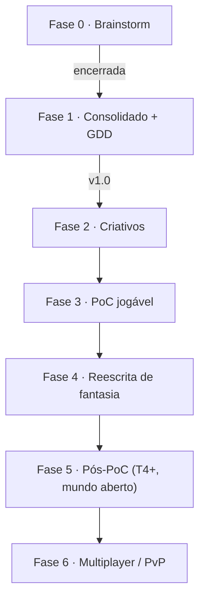

# Roadmap & Fases

Sem deadline (hobby). Fases são ordem lógica, não cronograma.

## Estado atual

- **Fase 0** — brainstorm das 3 IAs (concluída).
- **Fase 1** — Consolidado + GDD v1.0 (esta entrega).
- **Fase 2 (próxima)** — criativos.

## Marcos

| Fase | Entrega | Pronto quando |
| --- | --- | --- |
| 2 | JSONs de armas/skills/mobs/diálogos | Tutorial tem texto final |
| 3 | Backend Go + front; 8 passos | Critério de PoC validada |
| 4 | Placeholders do Albion removidos | Nenhum IP de terceiros no build |
| 5 | T4+, facções, mundo aberto | Loop de meta jogável |
| 6 | PvP/gank | Registrado, fora do escopo atual |

## Pendências conscientes

O que persiste no rebirth · imunidade offline no gank · quantidade de facções · título comercial (B2).